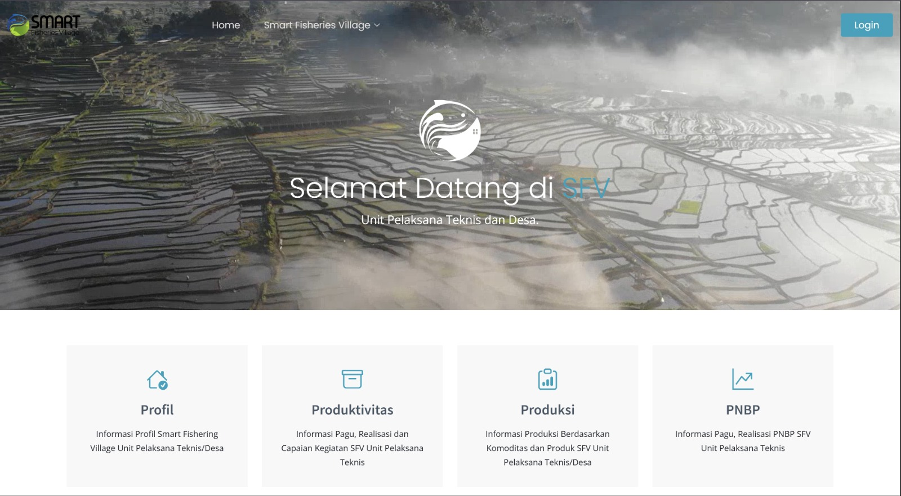
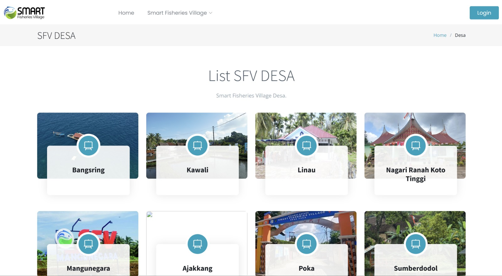
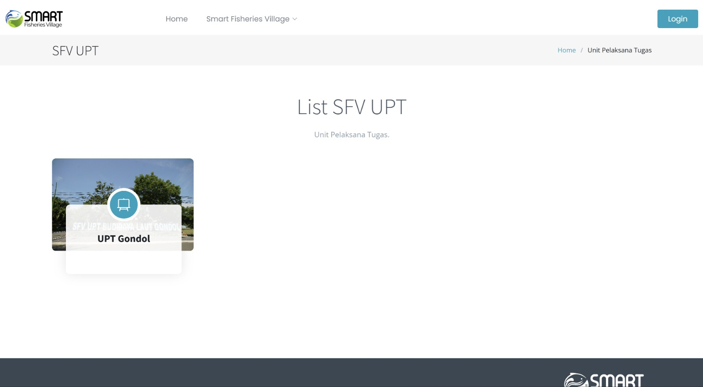
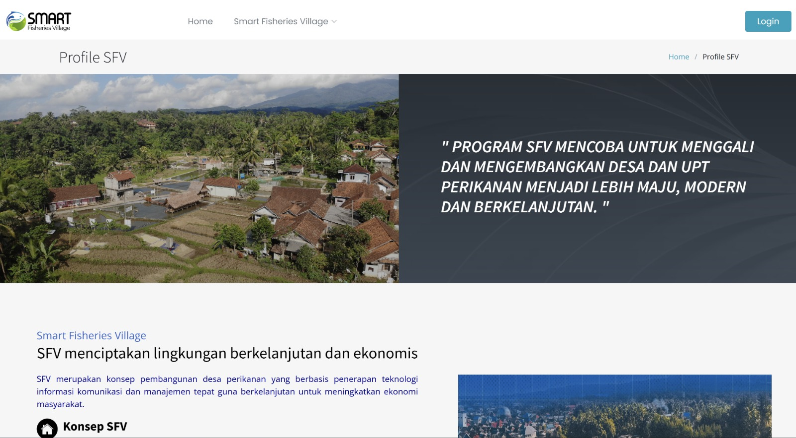
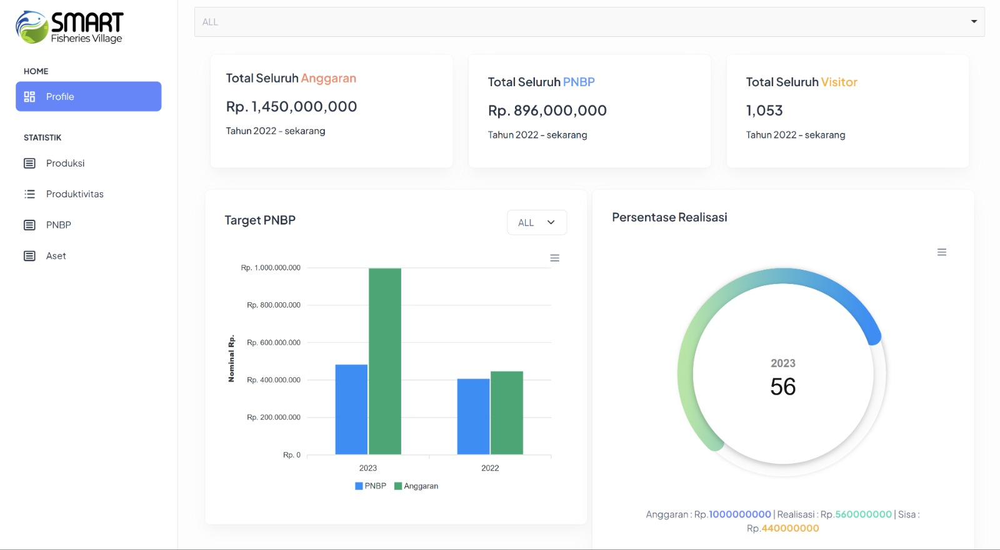
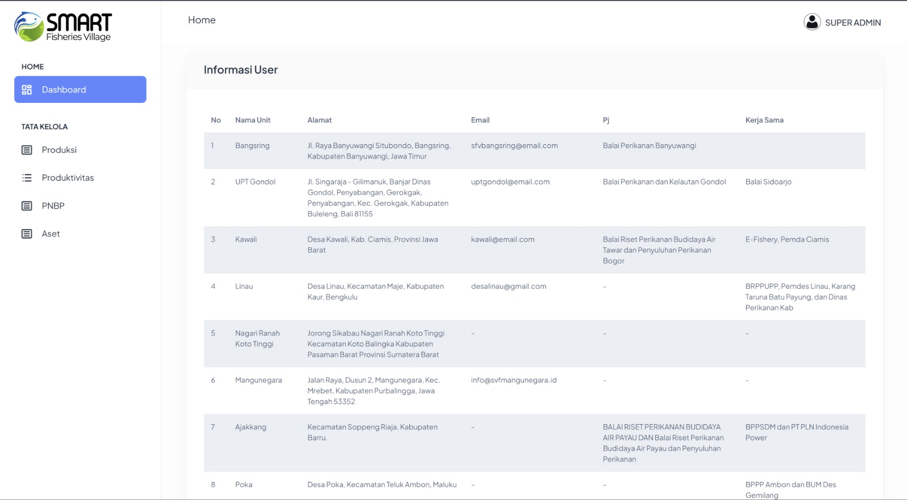

  

# 🐟 Smart Fisheries Village (SFV)
### Platform Monitoring & Informasi Publik

**Aplikasi web untuk memantau dan mempublikasikan data kinerja unit-unit Smart Fisheries Village — mencakup PNBP, produksi, produktivitas, dan aset secara interaktif.**

---

## 📸 Tampilan Aplikasi

### Landing Page

 

### List SFV Desa

 

### List SFV UPT

 

### Profile SFV

 

### Dashboard Monitoring Publik (per Unit)

 

### Super Admin Panel

---

## 🧠 Tentang Proyek

**Smart Fisheries Village (SFV)** adalah program pembangunan desa perikanan berbasis teknologi informasi yang digagas Kementerian Kelautan dan Perikanan RI. Platform ini dibangun untuk mempublikasikan dan memonitor data kinerja dari dua jenis SFV secara transparan — berbasis **UPT (Unit Pelaksana Teknis)** dan berbasis **Desa**.

Masyarakat dan stakeholder dapat mengakses data tiap unit SFV secara publik, mulai dari profil, statistik anggaran, PNBP, produksi komoditas, hingga data aset — disajikan dalam visualisasi grafik yang interaktif dan mudah dipahami.

---

## ✨ Fitur

- Landing page publik dengan hero video dan carousel unit SFV
- Halaman list SFV Desa & SFV UPT
- Profil detail tiap unit beserta peta lokasi (Google Maps embed)
- Dashboard monitoring publik per unit: statistik anggaran, PNBP, produksi, dan aset
- Visualisasi data interaktif (bar chart, pie chart, radial bar, area chart)
- Filter data berdasarkan unit dan tahun
- Halaman informasi: Profil SFV, konsep SMART (Sustainable, Modernization, Acceleration, Regeneration, Technology)
- Admin panel untuk kelola data per unit masing-masing
- Superadmin panel untuk monitoring seluruh unit lintas wilayah
- Export/download laporan PDF
- Manajemen pengguna dengan role (Admin & Superadmin)

---

## 🗂️ Modul Data

| Modul | Deskripsi |
|-------|-----------|
| **PNBP** | Penerimaan Negara Bukan Pajak — pagu, realisasi, dan perbandingan per tahun |
| **Produksi** | Data produksi berdasarkan komoditas dan produk tiap unit |
| **Produktivitas** | Realisasi anggaran vs target capaian kegiatan |
| **Aset** | Luas aset, penggunaan, dan sisa lahan tiap unit |
| **Profil Unit** | Informasi detail unit SFV: penanggung jawab, kerjasama, alamat, dan peta lokasi |

---

## 👥 Role Pengguna

| Role | Akses |
|------|-------|
| **Publik** | Melihat informasi & statistik semua unit SFV tanpa login |
| **Admin (Operator Unit)** | Kelola data unit sendiri (PNBP, produksi, produktivitas, aset) |
| **Superadmin** | Monitoring & kelola seluruh data lintas unit + manajemen pengguna |

---

## ⚙️ Tech Stack

| Layer | Teknologi |
|-------|-----------|
| Backend | Laravel (PHP) |
| Frontend | Blade Template + Bootstrap 5 |
| Database | MySQL |
| Chart | ApexCharts |
| Carousel | OwlCarousel 2 |
| Arsitektur | MVC |

---

*Platform informasi publik untuk program Smart Fisheries Village — Kementerian Kelautan dan Perikanan RI*

